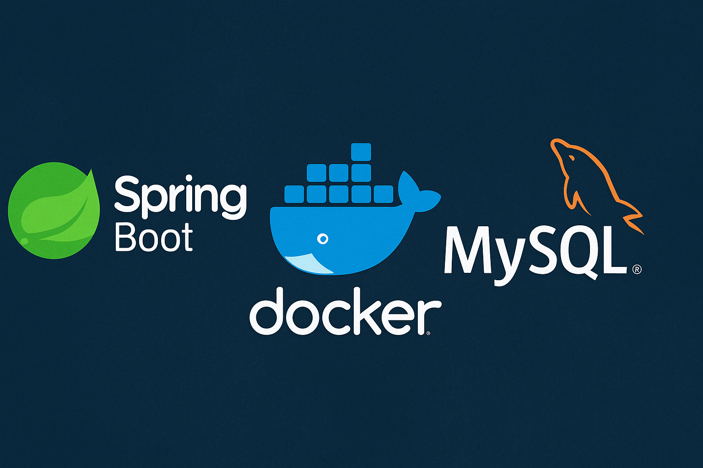

# 🚗 GearHub



## 📖 Sobre o Projeto

O GearHub é um sistema de gerenciamento de veículos projetado para auxiliar empresas no controle e manutenção de suas frotas. Desenvolvido com o framework Spring Boot e banco de dados MySQL, o sistema é executado em ambiente Docker, garantindo portabilidade e facilidade de implantação.

## 🎯 Funcionalidades

O GearHub possibilita o cadastro e monitoramento de entidades como empresas, sedes, veículos e seus componentes — incluindo baterias, pneus, trocas de óleo e documentos associados — oferecendo uma base sólida para expansão e integração futura.

## 🛠️ Tecnologias

- **Backend:** Spring Boot 3.5.7
- **Banco de Dados:** MySQL 8.0
- **ORM:** Spring Data JPA / Hibernate
- **Template Engine:** Thymeleaf
- **Estilização:** Tailwind CSS
- **API Documentation:** Swagger/OpenAPI 3.0
- **Containerização:** Docker & Docker Compose
- **Build:** Maven
- **Java:** 17

## 🚀 Como Executar

### Pré-requisitos

- Docker e Docker Compose instalados

### Passos

```bash
# Clone o repositório
git clone https://github.com/Kevin-Perdomo/GearHub.git
cd GearHub

# Configure as variáveis de ambiente
cp .env.example .env
# Edite o arquivo .env e modifique as credenciais conforme necessário

# Suba os containers
docker compose down && docker compose up --build -d
```

## 🌐 Acesso

Após subir os containers, acesse:

- **Aplicação Web:** http://localhost:8080
- **Documentação API (Swagger):** http://localhost:8080/swagger-ui.html

## 🌱 Gerenciar Dados do Banco (Opcional)

O sistema possui dois endpoints para gerenciar os dados:

**Via Swagger UI:**
1. Acesse: http://localhost:8080/swagger-ui.html
2. Localize a seção **Seed**
3. **POST /seed/api/executar** - Popular o banco com dados de exemplo
4. **POST /seed/api/limpar** - Limpar todos os dados do banco

**Via Terminal:**
```bash
# Popular o banco
curl -X POST http://localhost:8080/seed/api/executar

# Limpar o banco
curl -X POST http://localhost:8080/seed/api/limpar
```

## 📄 Licença

Este projeto está sob a licença especificada no arquivo [LICENSE](LICENSE).
